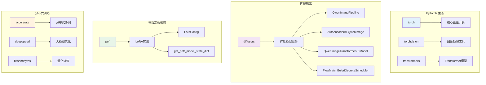
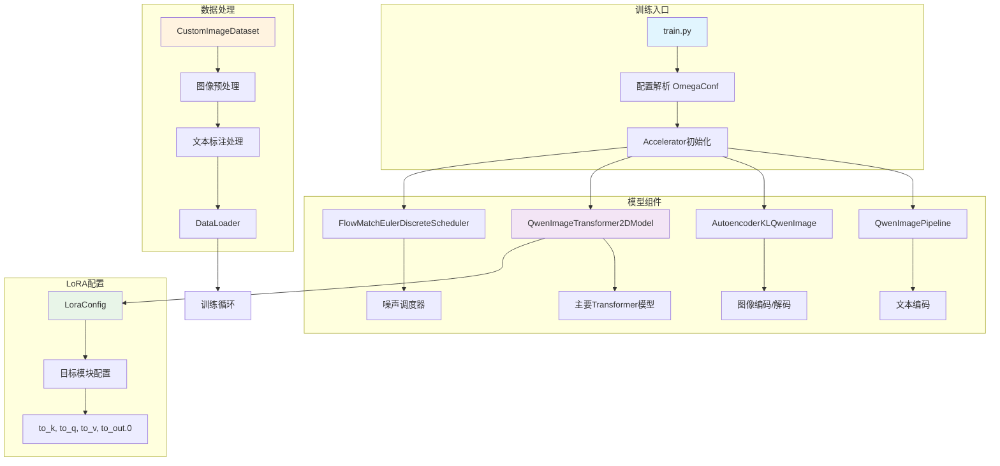
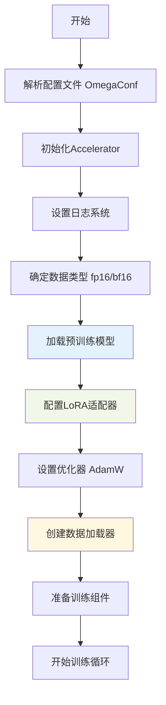
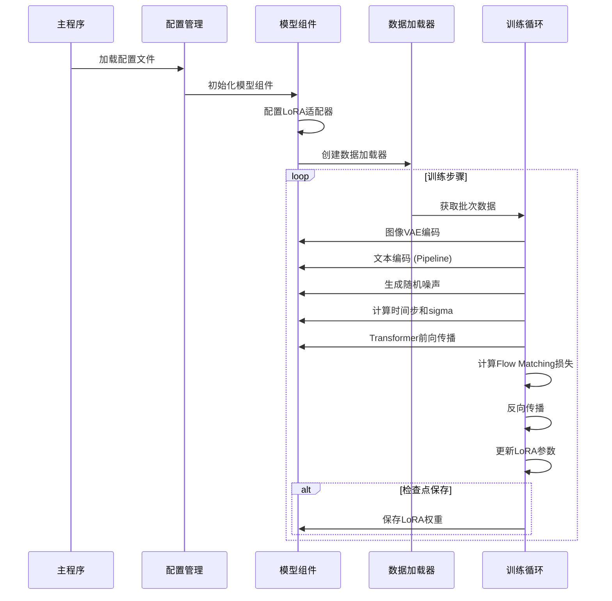
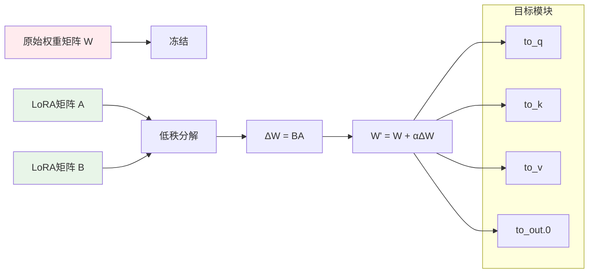
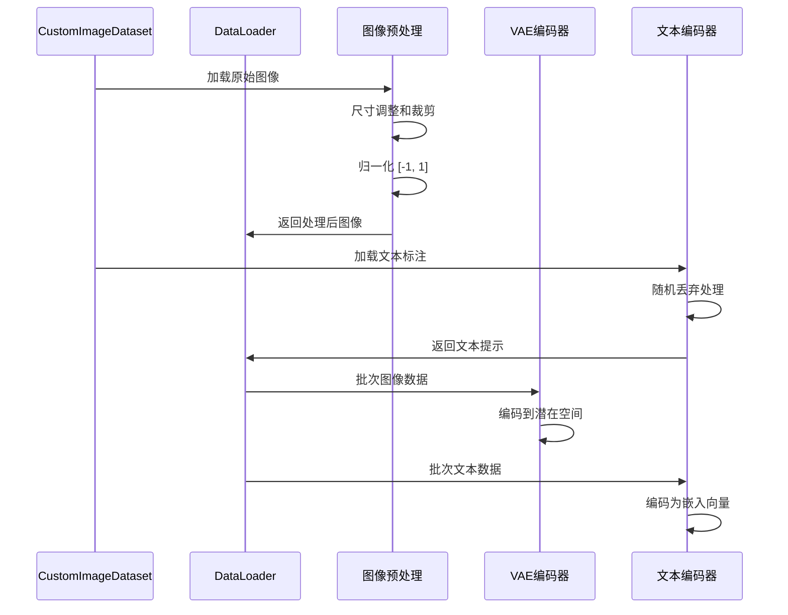
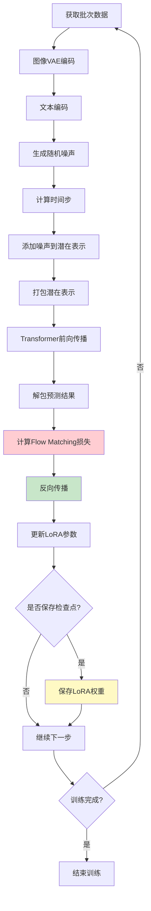
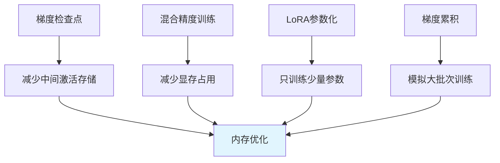

# Qwen-Image LoRA 训练实现完整分析

## 概述

本文档全面分析了 Qwen-Image LoRA 训练的核心实现，包括所需的依赖库、核心代码结构、训练流程和技术细节。

## 1. 核心依赖库详细分析

### 1.1 主要框架依赖

```yaml
# 深度学习框架
torch: PyTorch 核心框架
torchvision==0.22.1: 图像处理工具

# 分布式训练和加速
accelerate==1.9.0: 分布式训练和混合精度
deepspeed==0.17.4: 大模型训练优化

# 模型和数据处理
transformers==4.55.0: Transformer 模型库
diffusers: 扩散模型库 (特定Git版本)
peft==0.17.0: 参数高效微调 (LoRA)
datasets==4.0.0: 数据集处理

# 图像处理
opencv-python==4.12.0.88: 图像预处理
PIL: 图像加载和处理

# 配置和工具
omegaconf==2.3.0: 配置文件管理
tqdm: 进度条显示
loguru==0.7.3: 日志记录
einops==0.8.0: 张量操作
```

### 1.2 特殊依赖说明

- **diffusers**: 使用特定的 Git 版本 `git+https://github.com/huggingface/diffusers@7a2b78bf0f788d311cc96b61e660a8e13e3b1e63`，包含 Qwen-Image 相关组件
- **qwen_vl_utils==0.0.11**: Qwen 视觉语言模型专用工具
- **bitsandbytes**: 量化训练支持，8bit优化器
- **sentencepiece==0.2.0**: 多语言分词器
- **timm==1.0.19**: 图像模型库
- **onnxruntime==1.22.1**: ONNX推理支持

### 1.3 依赖库分类架构



## 2. 核心组件架构



## 3. 训练流程详细分析

### 3.1 初始化流程图



### 3.2 训练循环序列图



## 4. 核心代码实现详解

### 4.1 模型组件初始化

#### QwenImagePipeline 组件
```python
# 文本编码管道 - 负责处理文本提示词
text_encoding_pipeline = QwenImagePipeline.from_pretrained(
    args.pretrained_model_name_or_path,
    transformer=None,  # 不加载transformer，单独处理
    vae=None,         # 不加载VAE，单独处理
    torch_dtype=weight_dtype
)

# 核心功能：文本编码
prompt_embeds, prompt_embeds_mask = text_encoding_pipeline.encode_prompt(
    prompt=prompts,
    device=packed_noisy_model_input.device,
    num_images_per_prompt=1,
    max_sequence_length=1024,
)
```

#### AutoencoderKLQwenImage 组件
```python
# VAE编码器 - 图像与潜在空间转换
vae = AutoencoderKLQwenImage.from_pretrained(
    args.pretrained_model_name_or_path,
    subfolder="vae",
)

# 图像编码到潜在空间
pixel_latents = vae.encode(pixel_values).latent_dist.sample()
pixel_latents = pixel_latents.permute(0, 2, 1, 3, 4)

# 标准化处理
latents_mean = torch.tensor(vae.config.latents_mean).view(1, 1, vae.config.z_dim, 1, 1)
latents_std = 1.0 / torch.tensor(vae.config.latents_std).view(1, 1, vae.config.z_dim, 1, 1)
pixel_latents = (pixel_latents - latents_mean) * latents_std
```

#### QwenImageTransformer2DModel 组件
```python
# 主要 Transformer 模型
flux_transformer = QwenImageTransformer2DModel.from_pretrained(
    args.pretrained_model_name_or_path,
    subfolder="transformer",
)

# 噪声调度器
noise_scheduler = FlowMatchEulerDiscreteScheduler.from_pretrained(
    args.pretrained_model_name_or_path,
    subfolder="scheduler",
)
```

### 4.2 LoRA 实现机制



#### LoRA 配置代码
```python
lora_config = LoraConfig(
    r=args.rank,                    # 秩：控制LoRA矩阵的维度
    lora_alpha=args.rank,           # 缩放因子
    init_lora_weights="gaussian",   # 高斯初始化
    target_modules=["to_k", "to_q", "to_v", "to_out.0"],  # 注意力层
)

# 应用LoRA到transformer
flux_transformer.add_adapter(lora_config)

# 参数冻结策略
for n, param in flux_transformer.named_parameters():
    if 'lora' not in n:
        param.requires_grad = False  # 冻结原始参数
    else:
        param.requires_grad = True   # 训练LoRA参数
```

### 4.3 数据处理流程



#### 图像预处理核心代码
```python
def image_resize(img, max_size=512):
    """保持宽高比的图像缩放"""
    w, h = img.size
    if w >= h:
        new_w = max_size
        new_h = int((max_size / w) * h)
    else:
        new_h = max_size
        new_w = int((max_size / h) * w)
    return img.resize((new_w, new_h))

def crop_to_aspect_ratio(image, ratio="16:9"):
    """按比例裁剪图像"""
    width, height = image.size
    ratio_map = {"16:9": (16, 9), "4:3": (4, 3), "1:1": (1, 1)}
    target_w, target_h = ratio_map[ratio]
    target_ratio_value = target_w / target_h

    current_ratio = width / height
    if current_ratio > target_ratio_value:
        new_width = int(height * target_ratio_value)
        offset = (width - new_width) // 2
        crop_box = (offset, 0, offset + new_width, height)
    else:
        new_height = int(width / target_ratio_value)
        offset = (height - new_height) // 2
        crop_box = (0, offset, width, offset + new_height)

    return image.crop(crop_box)
```

### 4.4 训练循环核心逻辑



#### Flow Matching 损失计算
```python
# 1. 噪声调度
u = compute_density_for_timestep_sampling(
    weighting_scheme="none",
    batch_size=bsz,
    logit_mean=0.0,
    logit_std=1.0,
    mode_scale=1.29,
)
indices = (u * noise_scheduler_copy.config.num_train_timesteps).long()
timesteps = noise_scheduler_copy.timesteps[indices]

# 2. 获取sigma值
sigmas = get_sigmas(timesteps, n_dim=pixel_latents.ndim, dtype=pixel_latents.dtype)

# 3. 添加噪声
noisy_model_input = (1.0 - sigmas) * pixel_latents + sigmas * noise

# 4. 计算目标和损失
target = noise - pixel_latents  # Flow matching目标
weighting = compute_loss_weighting_for_sd3(weighting_scheme="none", sigmas=sigmas)
loss = torch.mean(
    (weighting.float() * (model_pred.float() - target.float()) ** 2).reshape(target.shape[0], -1),
    1,
)
```

### 4.5 检查点保存机制

```python
# LoRA权重提取和保存
unwrapped_flux_transformer = unwrap_model(flux_transformer)
flux_transformer_lora_state_dict = convert_state_dict_to_diffusers(
    get_peft_model_state_dict(unwrapped_flux_transformer)
)

# 使用Pipeline的保存方法
QwenImagePipeline.save_lora_weights(
    save_path,
    flux_transformer_lora_state_dict,
    safe_serialization=True,
)
```

## 5. 内存优化策略



### 5.1 关键优化代码
```python
# 1. 梯度检查点
flux_transformer.enable_gradient_checkpointing()

# 2. 混合精度设置
weight_dtype = torch.float32
if accelerator.mixed_precision == "fp16":
    weight_dtype = torch.float16
elif accelerator.mixed_precision == "bf16":
    weight_dtype = torch.bfloat16

# 3. 梯度累积
with accelerator.accumulate(flux_transformer):
    # 训练步骤
    pass

# 4. 梯度裁剪
if accelerator.sync_gradients:
    accelerator.clip_grad_norm_(flux_transformer.parameters(), args.max_grad_norm)
```

## 6. 关键特性总结

### 6.1 参数高效训练
- 仅训练 LoRA 参数，大幅减少显存需求
- 支持梯度检查点，进一步优化显存使用
- 可训练参数量通常只有原模型的1-5%

### 6.2 混合精度训练
- 支持 fp16 和 bf16 混合精度
- 自动梯度缩放和裁剪
- 显著降低显存占用和训练时间

### 6.3 分布式训练支持
- 基于 Accelerate 框架
- 支持多GPU和多节点训练
- 自动处理梯度同步和数据并行

### 6.4 灵活的数据处理
- 支持多种图像比例 (16:9, 4:3, 1:1)
- 文本标注随机丢弃 (caption dropout)
- 支持缓存机制优化训练速度

## 7. 配置文件结构详解

```yaml
# 模型配置
pretrained_model_name_or_path: Qwen/Qwen-Image

# 数据配置
data_config:
  img_dir: ./your_lora_dataset      # 训练图像目录
  img_size: 1024                    # 图像尺寸
  caption_dropout_rate: 0.1         # 文本丢弃率
  random_ratio: false               # 是否随机裁剪比例
  caption_type: txt                 # 标注文件类型

# 训练配置
train_batch_size: 1                 # 批次大小
max_train_steps: 3000              # 最大训练步数
learning_rate: 1e-4                # 学习率
lr_scheduler: constant             # 学习率调度器
mixed_precision: "bf16"            # 混合精度类型
gradient_accumulation_steps: 1     # 梯度累积步数

# LoRA 配置
rank: 16                           # LoRA 秩

# 检查点配置
checkpointing_steps: 250           # 检查点保存间隔
checkpoints_total_limit: 10        # 最大检查点数量
output_dir: ./output               # 输出目录
```

## 8. 版本兼容性和安装建议

### 8.1 环境要求
- Python: 3.8-3.11 (推荐3.9+)
- PyTorch: 2.0+
- CUDA: 11.8/12.1
- 显存: 至少8GB (推荐24GB+)

### 8.2 安装步骤
```bash
# 1. 创建虚拟环境
conda create -n qwen-lora python=3.9
conda activate qwen-lora

# 2. 安装PyTorch
pip install torch torchvision --index-url https://download.pytorch.org/whl/cu118

# 3. 安装依赖
pip install -r requirements.txt
```

## 9. 总结

Qwen-Image LoRA 训练实现了一个完整且高效的图像生成模型微调框架，具有以下核心优势：

1. **技术先进性**: 基于最新的Flow Matching技术和LoRA参数高效微调
2. **资源友好**: 通过多种优化策略大幅降低显存和计算需求
3. **易于使用**: 提供完整的配置文件和数据处理流水线
4. **扩展性强**: 支持分布式训练和多种硬件配置
5. **实用性高**: 可快速适配个人数据集进行定制化训练

该框架为大规模图像生成模型的个性化微调提供了一个实用且高效的解决方案，特别适合资源有限的研究者和开发者使用。
